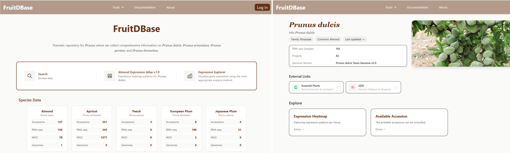
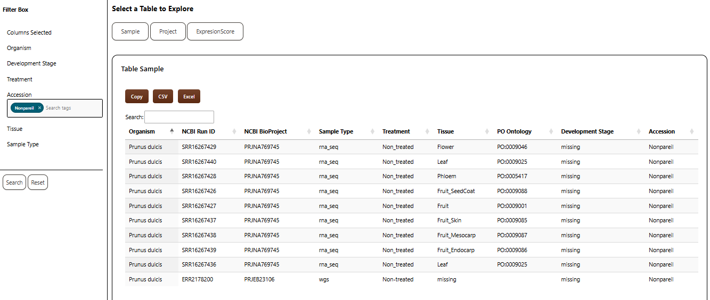
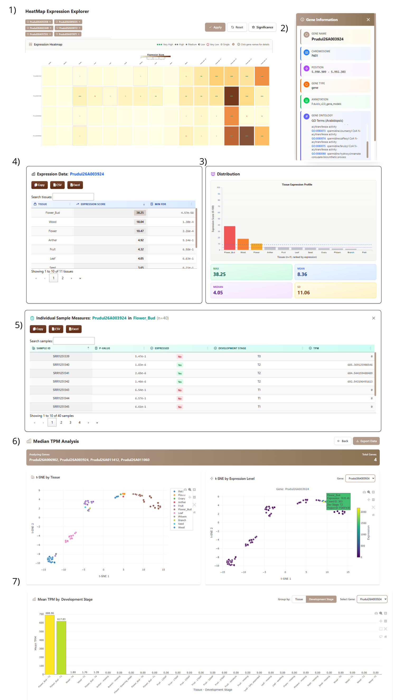

# FruitDBase: Transcriptomic Data Repository for *Prunus* Species
 

A web-based thematic repository for *Prunus* species that enables visualization and download of transcriptomic and genomic data, of *Prunus dulcis*, *Prunus persica*, *Prunus armeniaca*, and *Prunus domestica*.

🌐 **Live platform:** https://fruitdbase.csic.es/
---
# Preview

**Figure 1.** Homepage and species description page.

---
## Searcher
The Searcher module provides an interactive table interface designed for seamless exploration and retrieval of metadata and datasets. It serves as a central hub for users to filter, select, and export specific subsets of data.

**Features:**

- Interactive DataTable
- Column-based sorting and global search
- Multi-field filtering using the filter box (organism, tissue, development stage, etc.)
- Direct links to original data sources
- Export options: Copy, CSV, Excel

**Figure 2.** Search interface querying species (*Prunus dulcis*) and cultivar (Nonpareil).

---

## Almond Expression Atlas v1.0
Interactive heatmap visualization of gene expression data from Almond Expression Atlas v1.0

**Features:**
- Multi-tissue expression heatmaps (genes × tissues)
- Expression profiles by tissue and developmental stage for flower bud, fruit, and wood
- Bar plots showing expression levels per tissue with color-coded thresholds
- Dynamic filtering by tissue selection, expression score ranges, and top N genes
- Interactive legend for filtering by expression thresholds
- Data export functionality
-  Gene Ontology (GO) term integration for functional characterization of genes using both *Arabidopsis thaliana* and *Prunus dulcis* annotations.

**Example visualization of expression using mean TPM and the Bgee aproach**

**Figure 3.** Given a set of selected genes:
- (1.A) Heatmap of general tissues for the selected specific genes  
- (1.B) Heatmap of tissues with developmental stage for floral bud for the selected specific genes  
- (2) Information about the selected gene  
- (3,4) Barplot and table with expression by general tissue  
- (5) Expression data for the samples used to calculate the expression of the selected tissue
- (6) t-SNE plot by tissue and expression level to complement the barplot
- (7) Barplot of expression by development stage and tissue, with an option to visualize expresion by tissue 

## Data Sources

- **Expression data:** 
Expression profiles were generated using two approaches: (1) Bgee methodology, and (2) median TPM per tissue. A total of 205 RNA-Seq samples representing all publicly available data for Prunus dulcis were retrieved from the Sequence Read Archive (SRA) obtained using bears R library(Almeida-Silva et al., 2023).  After manual quality filtering and selecting only control conditions, 85 samples were retained for the baseline dataset. An additional 35 samples from an unpublished project were included, resulting in a total of 100 for the first almond expression atlas.

- **Functional annotations:** GO terms for *Prunus dulcis* were obtained from the Genome Database for Rosaceae (GDR), and annotations for *Arabidopsis thaliana* were obtained from EnsemblPlants.

---

## Technology

**Backend:** PHP, MySQL  
**Frontend:** D3.js v7, DataTables, Tailwind CSS, JavaScript

---

## Development Status

**Under active development** - Repository in preparation for public release.

---

## 📜 Data Availability

### Data License
All expression matrices and derived datasets are released under the  
**Creative Commons Attribution 4.0 International (CC BY 4.0)** license.

👉 https://creativecommons.org/licenses/by/4.0/

This means you are free to:
- Use the data
- Share and redistribute it
- Adapt and build upon it  
**as long as proper attribution is given**

For any questions or collaborations, please contact: emlopez@cebas.csic.es

---

## Contact
Department of Plant Breeding, Fruit Breeding Group, CEBAS-CSIC, Espinardo, Murcia, Spain.

For inquiries, please contact: emlopez@cebas.csic.es

---
